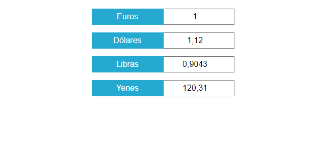

# Conversor de divisas usando una api :wolf:

---

## Tecnologias usadas

- javascript
- css
- html

### imagen :horse:

### api usada

[link](https://api.exchangeratesapi.io/latest?symbols=USD,GBP,JPY)
